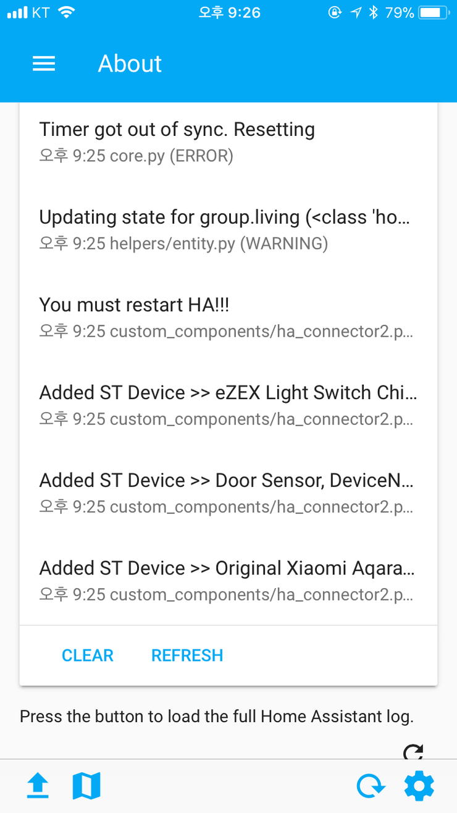

## Warning
This connector works ha version 0.95.4.<br/>
This connector might delete your configuration. Backup first.<br/>
This will not work ha with https.<br/>
<br/><br/>

## Install Device Type Handler (DTH)

### Manual install
```
Go to the SmartThings IDE
Click My Device Handlers
Click Create New Device Handlers
Copy content of file in the devicetypes/fison67 folder to the area
Click Create
Loop until all of file is registered
```

### Install DTH using the GitHub Repo integration
> Enable the GitHub integration before continuing the installation. Perform step 1 and 2 in the [SmartThings guide](https://docs.smartthings.com/en/latest/tools-and-ide/github-integration.html#step-1-enable-github-integration) to enable the GitHub integration for your SmartThings account.

```
1. Go to the SmartThings IDE
2. Select the My Device Handlers tab
3. Click on the "Settings" button
4. Click on the "Add new repository" option and fill in the following information:
    Owner: fison67
    Name: HA-Connector
    Branch: master
5. Click on the "Save" button
6. Click on the "Update from Repo" button and select the "HA-Connector (master)" option
7. Check the checkbox for the device types you need (or all of them) in the "New (only in GitHub)" column
8. Check the "Publish" checkbox and click on the "Execute Update" button
```

## Install SmartApp
```
Connect to the SmartThings IDE
Click My SmartApps
Click New SmartApp
Click From Code
Copy content of HA-Connector.groovy & Paste
Click Create
Click My SmartApps & Edit properties (HA Connector)
Enable OAuth
Update Click
```

### Install SmartApp using the GitHub Repo integration
> Enable the GitHub integration before continuing the installation. Perform step 1 and 2 in the [SmartThings guide](https://docs.smartthings.com/en/latest/tools-and-ide/github-integration.html#step-1-enable-github-integration) to enable the GitHub integration for your SmartThings account.

```
1. Go to the SmartThings IDE
2. Select the My SmartApps tab
3. Click on the Settings button
4. Click on the "Add new repository" option and fill in the following information:
    Owner: fison67
    Name: HA-Connector
    Branch: master
5. Click on the "Save" button
6. Click on the "Update from Repo" button and select the "HA-Connector (master)" option
7. Check the checkbox for the device types you need (or all of them) in the "New (only in GitHub)" column
8. Check the "Publish" checkbox and click on the "Execute Update" button
9. Select the My SmartApps tab
10. Click on the "Edit Properties" button for the HA Connector SmartApp (fison67 : HA Connector)
11. Click on the "OAuth" option and click on the "Enable OAuth" button
12. Click on the "Update" button
```
Step 3 and 4 are only needed if the repo has not been added earlier (e.g. in the DTH installation).

### Setup Smartapp
```
1. Open a Smartthings & Click a Automation tab.
2. Press a [ Add a SmartApp ]
3. Add a HA Connector with HA Address & HA Password
   HA Address: 192.168.0.100:8123
   HA Password: passwordValue (This value is http_password of configruation.yaml)
4. Open a HA Connector smartapp.
5. Do again step 3.
6. Open a ha connector then click a config
6. You can see a app_url, app_id, access_token.
```


### Setup HA
```
0. Backup your configuration.yaml include other setup file.
   This connector might delete your configuration.
1. Open a configuration.yaml
Add a contents like below

ha_connector:
   app_url: xxxx
   app_id: xxxxx
   access_token: xxxxx
   
ha_connector2:
   app_url: xxxx
   app_id: xxxxx
   access_token: xxxxx

automation: !include automations.yaml
sensor: !include sensors.yaml
switch: !include switchs.yaml

2. Make a folder custom_components in ha config folder.
3. Copy a ha_connector.py, ha_connector2.py to custom_components.
4. Make a folder stsensor, stswitch from github.
5. Copy files to stsensor, stswitch from github.
6. Restart a HA
```

### Setup HA Intergration( ha version >= 0.110 )
```
0. Target only files in the following path.[ custom_components/ha_connector ]
1. Make a folder custom_components in ha config folder.
2. Copy a folder ha_connector to custom_components.
3. Configration > Intergrations > ADD INTERGRATION > Search "HA-Connector" and choice item.
4. Input configration app_url, app_id, access_token
```

### Add a device
1. From HA to ST
```
  a. Open a ha connector smartapp.
  b. Click a Get HA Devices.
  c. If you see a 200 code, it's success to get device list from HA.
  d. Click a Add HA device.
  e. Select a device if you want.
```

2. From ST to HA
```
  a. Open a ha connector smartapp.
  b. Click a Add ST Device.
  c. Select a device if you want.
  d. Restart a HA then see a log as below. Then Restart a HA again.
```



